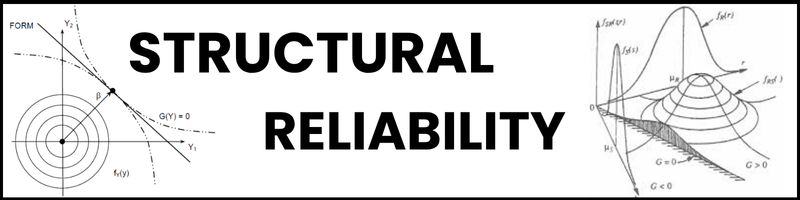

# Reliability - Python Structural Reliability Analysis

Python Module for Structural Reliability Analysis

## Features
- Includes a large variety of statistical distributions
- Correlation between the random variables is possible
- Simulation methods with and without intelligent sampling techniques
- Incorporates the use of graphs to analyze the uncertainty of the probability of failure in each iteration

## Full documentation
To access the full documentation, download the repository and go to docs/_build/html/index.html

## Installation

1 - Open a terminal and run the following command to clone the repository:
```bash
git clone https://github.com/Brunoengi/reliability.git
```
2 - Navigate to the project directory:
```bash
cd reliability
```
3 - Install the dependencies:
```bash
pip install -r requirements.txt
```
4 - Install the realibity package:
```bash
pip install -e .
```

## List of References

### Books:
- ANG, A. H-S.; TANG, W. H.. Probability concepts in engineering planning and design. Volume I: basic principles. New York, John Wiley & Sons, 1975.
- ANG, A. H-S.; TANG, W. H.. Probability concepts in engineering planning and pesign. Volume II: decision, risk and reliability. New York, John Wiley & Sons, 1984.
- ANG, A. H-S.; TANG, W. H.. Probability concepts in engineering: Emphasis on applications to Civil and Enviromental Engineering. 2nd ed. Hoboken, NJ, John Wiley & Sons, 2007.
- BECK, A. T. Confiabilidade e segurança das estruturas. Rio de Janeiro, Elsevier, 2019.
- HALDAR, A. MAHADEVAN, S. Probability, reliability, and statistical methods in engineering design. New York, Wiley, 2000.
- MELCHERS, R.E., BECK, A. T.; Structural reliability analysis and prediction. 3rd ed. John Wiley and Sons, 2018, 514p.

### Repositories:
- [Confiabilidade em Engenharia (Reliability in Engineering)](https://github.com/mvreal/Confiabilidade-em-Engenharia).


Forked based on [Reliability - Mauro Real](https://github.com/mvreal/Reliability).